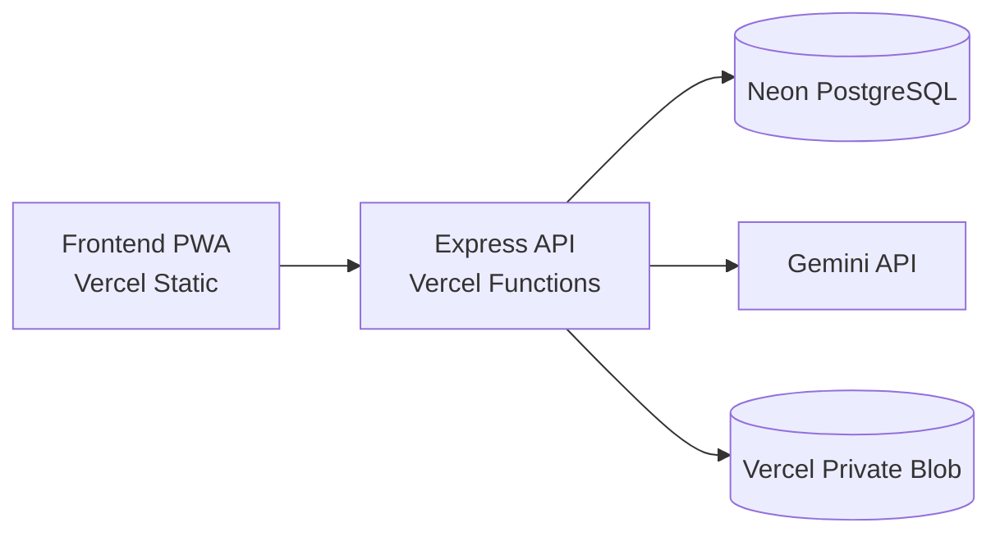

# MeaningEdu

MeaningEdu adalah PWA pembelajaran Fisika yang menghubungkan aktivitas belajar, jurnal refleksi, AI pendamping, serta analitik Meaningful Learning Index (MLI). Repository ini berisi baseline MeaningEdu 01 dan implementasi MLI v2 MeaningEdu 02.

## Arsitektur aktif



- Frontend adalah HTML/CSS/JavaScript statis di root repository.
- Backend Node.js/Express berada di `backend/` dan dijalankan sebagai Vercel Function.
- Neon hanya berfungsi sebagai PostgreSQL, bukan server backend.
- Binary PDF berada di Vercel Private Blob. Neon hanya menyimpan metadata dan `blob_pathname`.
- Alamat API frontend didefinisikan satu kali di `config.js`.

## Cakupan MeaningEdu 01

- Deployment Vercel–Neon dinormalisasi tanpa konfigurasi backend lama.
- Jurnal dapat masuk antrean IndexedDB ketika offline atau request gagal, lalu dicoba ulang melalui Background Sync/fallback halaman.
- Retry jurnal memakai `client_submission_id`, sehingga kiriman yang sama tidak menggandakan jurnal atau skor MLI.
- Pendaftaran guru memerlukan persetujuan admin; siswa aktif langsung setelah mendaftar.
- Middleware membaca status dan peran terbaru dari database, bukan mempercayai klaim peran dari browser/JWT.
- Resource kelas, aktivitas, jurnal, materi, MLI, AI, dan PDF dibatasi berdasarkan peran, ownership, serta enrollment.
- Persamaan Fisika dirender dengan KaTeX lokal menggunakan `\(...\)` dan `\[...\]`, termasuk saat aset PWA digunakan offline.
- Guru dapat mengunggah PDF ke Blob privat; hanya guru pemilik kelas dan siswa terdaftar yang dapat meminta URL baca sementara.
- MLI v2 (`MLI-v2.0-EW`) memakai dua butir micro-survey untuk Otonomi dan Persepsi Kompetensi; Gemini hanya mengode dua indikator rubrik 0–3 beserta kutipan untuk masing-masing Relevansi, Keterlibatan, dan Metakognisi. Setiap dimensi berbobot 20%. Data hilang menghasilkan `null`, bukan nol. Kegagalan analisis teks menjadi `PENDING_ANALYSIS` dan dapat dicoba ulang oleh guru. Skor v1 tidak masuk dashboard atau tren v2.
- Rata-rata MLI kelas hanya ditampilkan ketika paling sedikit 70% siswa terdaftar memiliki observasi lengkap. Tren mingguan menggunakan observasi lengkap terbaru per siswa dan aktivitas pada minggu tersebut; versi formula, status cakupan, rincian survei dan bukti teks tersedia untuk guru. Angka ini indeks prototipe, bukan persentase kemampuan atau alat psikometrik tervalidasi.

## Struktur penting

```text
MeaningEdu/
├── config.js                   # konfigurasi publik URL API
├── app.js                      # autentikasi dan helper frontend
├── sw.js                       # cache PWA + sinkronisasi jurnal
├── math-render.js              # konfigurasi KaTeX yang aman
├── vendor/katex/               # KaTeX 0.18.7 dan font lokal
├── admin.html                  # persetujuan akun guru
├── dashboard-guru.html
├── workspace-siswa.html
└── backend/
    ├── config/                 # koneksi Neon
    ├── controllers/
    ├── middleware/             # autentikasi + role authorization
    ├── migrations/
    ├── routes/
    ├── scripts/                # runner migrasi + provisioning admin
    ├── services/               # MLI scoring
    ├── tests/
    └── server.js
```

## Menjalankan secara lokal

Persyaratan: Node.js 20 atau lebih baru, PostgreSQL/Neon, dan kredensial Gemini. Pengujian PDF memerlukan Vercel Private Blob.

```bash
git clone https://github.com/dimascn18-dotcom/MeaningEdu.git
cd MeaningEdu/backend
npm ci
cp .env.example .env
npm run migrate
npm run admin:create
npm run dev
```

Sajikan folder root dengan server statis, misalnya Live Server di VS Code. Untuk backend lokal, ubah sementara `API_BASE_URL` di `config.js` menjadi `http://localhost:5500`. Jangan menaruh secret di `config.js` karena file itu dikirim ke browser.

## Environment backend

Salin `backend/.env.example` menjadi `backend/.env` untuk pengembangan lokal.

| Variabel | Kegunaan |
|---|---|
| `DATABASE_URL` | Connection string Neon/PostgreSQL |
| `JWT_SECRET` | Secret penandatanganan JWT; gunakan nilai acak panjang |
| `GEMINI_API_KEY` | Akses model Gemini |
| `CORS_ORIGINS` | Daftar origin frontend yang diizinkan, dipisahkan koma; wajib di production |
| `BLOB_STORE_ID` | ID Private Blob store; otomatis ketika store terhubung ke project |
| `VERCEL_OIDC_TOKEN` | Disediakan dan dirotasi Vercel; jangan salin ke source code |
| `BLOB_READ_WRITE_TOKEN` | Fallback pengembangan di luar Vercel bila OIDC tidak tersedia |
| `ADMIN_NAME` | Nama admin untuk skrip provisioning |
| `ADMIN_EMAIL` | Email admin |
| `ADMIN_PASSWORD` | Kata sandi awal admin, minimal 12 karakter |

Di production, isi `CORS_ORIGINS` dengan origin frontend yang tepat dan hubungkan Blob store privat ke project backend agar Vercel menyediakan OIDC dan `BLOB_STORE_ID`. Jangan mengekspos kredensial Blob ke frontend.

## Database dan migrasi

```bash
cd backend
npm run migrate
```

Migrasi dijalankan berurutan dan dicatat dalam `schema_migrations`. `0000_init_schema_neon.sql` hanya membuat struktur baseline yang aman terhadap tabel existing. Index yang bergantung pada kolom baru dibuat oleh migration incremental setelah kolomnya dipastikan tersedia. Karena itu perintah yang sama dapat dipakai pada database fresh maupun schema MeaningEdu legacy tanpa SQL manual. Jalankan migrasi sebelum backend baru karena autentikasi membutuhkan `status_akun`, sedangkan PDF dan jurnal membutuhkan kolom tambahan.

Provision atau rotasi akun admin:

```bash
ADMIN_NAME="Admin MeaningEdu" \
ADMIN_EMAIL="admin@example.sch.id" \
ADMIN_PASSWORD="kata-sandi-panjang" \
npm run admin:create
```

Skrip melakukan upsert berdasarkan email dan tidak mencetak kata sandi.

## Alur persetujuan guru

1. Calon guru mendaftar melalui halaman publik.
2. Backend menyimpan akun sebagai `status_akun = 'pending'` tanpa menerbitkan token.
3. Admin masuk dan membuka `admin.html`.
4. Admin menyetujui atau menolak permohonan.
5. Hanya akun berstatus `aktif` yang melewati middleware autentikasi.

Akun siswa langsung aktif. Akun lama diaktifkan saat migrasi agar pengguna yang sudah ada tidak terkunci.

## Persamaan Fisika

Source matematika disimpan sebagai teks LaTeX, bukan HTML. Format yang didukung:

```text
Inline: \(E = mc^2\)

Blok:
\[
F = \frac{dp}{dt}
\]
```

Delimiter dolar tidak digunakan. KaTeX berjalan dengan `trust: false`, dan AI Simplifier memakai placeholder sementara agar persamaan dikembalikan tanpa perubahan. JavaScript, CSS, dan font KaTeX disimpan lokal serta masuk precache Service Worker.

## Upload dan akses PDF

1. Guru pemilik kelas meminta URL upload sementara.
2. Browser mengunggah PDF langsung ke Private Blob melalui signed `PUT`.
3. Backend memeriksa pathname, MIME, dan ukuran objek dengan Blob `head()`.
4. Neon menyimpan judul, topik, dimensi MLI, nama file, MIME, ukuran, dan `blob_pathname`.
5. Backend memeriksa ownership guru atau enrollment siswa sebelum menerbitkan signed `GET` selama lima menit.

PDF dibatasi 10 MB. MIME dan ekstensi diperiksa di browser, signed upload, serta backend. PDF tidak tersedia offline dan signed URL tidak disimpan di database.

## Batas dukungan offline

Offline MeaningEdu 01 bersifat parsial:

- Halaman, CSS, JavaScript, dan KaTeX dapat dibuka dari Cache Storage setelah pernah dimuat.
- Jurnal yang sudah disusun dapat disimpan di IndexedDB dan disinkronkan ketika koneksi tersedia.
- Kelas, aktivitas, daftar materi, AI, dashboard MLI, dan PDF masih membutuhkan backend online.
- PDF tidak dimasukkan ke Cache Storage.
- Background Sync tidak tersedia di semua browser; halaman juga memicu retry saat dibuka atau kembali online.

## Pengujian

```bash
cd backend
npm test
npx playwright install chromium
TEST_DATABASE_URL="postgresql://..." npm run test:e2e
```

`npm test` mencakup alur MeaningEdu 01 dan MLI v2 (formula, data hilang, validasi kutipan, cakupan kelas, tren, otorisasi, kegagalan Gemini). Bila `TEST_DATABASE_URL` tersedia, suite yang sama membuat database disposable fresh dan legacy, menjalankan migration dua kali, memeriksa schema akhir, lalu menghapus database tersebut.

`npm run test:e2e` menjalankan Chromium terhadap frontend dan Express API nyata dengan PostgreSQL test. Integrasi Gemini dan Private Blob diganti stub deterministik khusus test; route aplikasi, JWT, ownership/enrollment, penulisan metadata, dan rendering browser tetap menggunakan implementasi production. Skenario membuktikan output rumus AI dirender KaTeX tanpa delimiter mentah, upload PDF mencapai `/pdf/complete`, siswa enrolled dapat membuka PDF, dan siswa non-enrolled menerima `403`.

Workflow `.github/workflows/ci.yml` menjalankan `npm ci`, unit/integration test dengan service PostgreSQL 16, dependency audit, browser E2E Chromium, dan Gitleaks pada setiap pull request serta push ke branch utama/stabilisasi. Artifact laporan Playwright disimpan selama 14 hari.

## Deployment

Gunakan dua project Vercel dari repository yang sama:

1. **Backend** — Root Directory `backend`, environment sesuai tabel di atas, dan Private Blob terhubung ke project.
2. **Frontend** — Root Directory repository (`.`), konfigurasi statis dari `vercel.json`.

Urutan rilis aman:

1. jalankan `npm run migrate` terhadap Neon production;
2. provision akun admin bila belum ada;
3. deploy backend dan pastikan endpoint `/` merespons;
4. pastikan `config.js` menunjuk deployment backend yang benar;
5. deploy frontend;
6. smoke-test registrasi siswa, permohonan guru, approval admin, jurnal online/offline, rumus, dan PDF lintas peran.

Jangan commit `.env`, token Blob, connection string database, JWT secret, atau API key.
